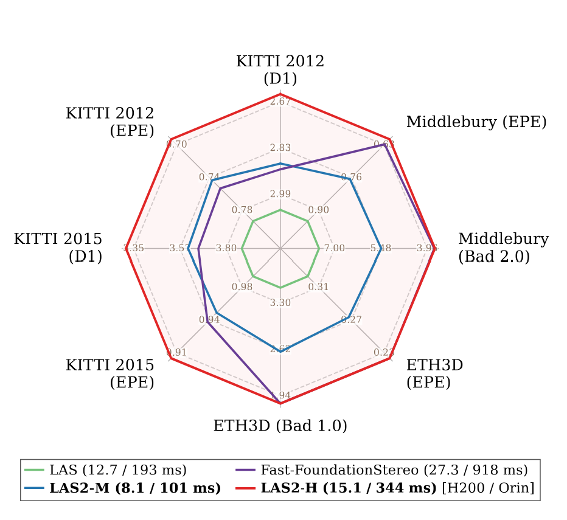

<h1 align="center">Lite Any Stereo Series</h1>

<p align="center">
  <a href="https://arxiv.org/abs/2511.16555" target="_blank" rel="external nofollow noopener">
  </a>
  <a href="https://tomtomtommi.github.io/LiteAnyStereo/"></a>
  <a href="https://arxiv.org/abs/2606.24457" target="_blank" rel="external nofollow noopener">
  </a>
  <a href="https://tomtomtommi.github.io/LiteAnyStereoV2/"></a>
</p>

<p align="center">
  <strong>Official codebase for the Lite Any Stereo (LAS) series.</strong><br>
  This repository supports LAS1 and LAS2 S/M/L/H release models.
</p>


## Overview
**Lite Any Stereo** is a series of efficient zero-shot stereo matching models for practical deployment. This repository contains the public evaluation and inference code for **LAS1** and **LAS2**.

| Version | Title | Resources |
| --- | --- | --- |
| LAS1 | [CVPR2026] Lite Any Stereo: Efficient Zero-Shot Stereo Matching | [Paper](https://arxiv.org/abs/2511.16555), [Project page](https://tomtomtommi.github.io/LiteAnyStereo/) |
| LAS2 | Lite Any Stereo V2: Faster and Stronger Efficient Zero-Shot Stereo Matching | [Paper](https://arxiv.org/abs/2606.24457), [Project page](https://tomtomtommi.github.io/LiteAnyStereoV2/) |

## Performance Snapshot

<p align="center">
  
</p>

<p align="center">
  <em>Zero-shot performance and runtime comparison. Runtime is reported on H200 / Orin 8G.</em>
</p>

## Checkpoints

The pretrained checkpoints are hosted on [Hugging Face](https://huggingface.co/tomtomtommi/LiteAnyStereoV2). A Google Drive mirror is also available [here](https://drive.google.com/drive/folders/1UvDx296pVk7pC2rozKIpQF_EXcOleZOB?usp=sharing). Please place the downloaded checkpoints in `./checkpoints/`. The release uses the following default filenames:

| Model | Default checkpoint |
| --- | --- |
| LAS1 | `./checkpoints/LiteAnyStereo.pth` |
| LAS2-S | `./checkpoints/LAS2_S.pth` |
| LAS2-M | `./checkpoints/LAS2_M.pth` |
| LAS2-L | `./checkpoints/LAS2_L.pth` |
| LAS2-H | `./checkpoints/LAS2_H.pth` |

LAS2 defaults to the M model when `--model_size` is not specified. You can always pass a checkpoint explicitly with `--restore_ckpt`.

## Demo

Several side-by-side stereo image pairs are provided in `./assets/`. Pass `--stereo_file` to use another pair. Run LAS1:

```bash
python demo.py --version las1 --restore_ckpt ./checkpoints/LiteAnyStereo.pth
```

Run LAS2-M:

```bash
python demo.py --version las2 --model_size m --restore_ckpt ./checkpoints/LAS2_M.pth
```

Run another LAS2 release model by changing `--model_size`:

```bash
python demo.py --version las2 --model_size h --restore_ckpt ./checkpoints/LAS2_H.pth
```

The demo saves the disparity visualization, raw disparity array, and optional point-cloud outputs to `--out_dir`.

## Evaluation

To reproduce the benchmark evaluation commands, run:

```bash
VERSION=las1 sh evaluate.sh
VERSION=las2 MODEL_SIZE=s sh evaluate.sh
VERSION=las2 MODEL_SIZE=m sh evaluate.sh
VERSION=las2 MODEL_SIZE=l sh evaluate.sh
VERSION=las2 MODEL_SIZE=h sh evaluate.sh
```

You can also evaluate one dataset directly:

```bash
python evaluate_stereo.py --version las2 --model_size h --restore_ckpt ./checkpoints/LAS2_H.pth --dataset middlebury_H
```

Supported datasets are `middlebury_F`, `middlebury_H`, `middlebury_Q`, `eth3d`, `kitti`, and `drivingstereo`.

## MACs

To compute model complexity:

```bash
python flops_count.py --version las1
python flops_count.py --version las2 --model_size m
python flops_count.py --version las2 --model_size h
```

## Runtime

To measure inference time:

```bash
python profile_speed.py --version las1
python profile_speed.py --version las2 --model_size m
python profile_speed.py --version las2 --model_size h
```

The runtime script uses CUDA synchronization when running on GPU.

## LAS2-S Baseline and HFE/CVS Training Extension

This fork keeps the original LAS2-S baseline code and the best HFE/CVS modified model code for supervised fine-tuning and teacher-student distillation. Training is kept DDP-only: use `torchrun --nproc_per_node=8` for 8 GPUs, or `torchrun --nproc_per_node=1` for a single GPU.

Main added entry points:

| File | Purpose |
| --- | --- |
| `train_las2_s_ddp.py` | DDP training entry for the LAS2-S baseline and final HFE/CVS modified model. |
| `train_las2_s_distill_ddp.py` | DDP teacher-student distillation entry for the HFE/CVS modified model. |
| `evaluate_las2_s.py` | Evaluation for baseline, modified, and distillation checkpoints. |
| `las2_s_baseline_train_utils.py` | Shared LAS2-S baseline configuration, model-loading, loss, and validation helpers. |
| `las2_s_hfe_train_utils.py` | Shared HFE/CVS dataset, model-loading, optimizer, loss, metric, and validation helpers. |
| `las2_s_loss_config.py` | Final modified-model loss/config validation helpers. |
| `configs/` | Example YAML configs for baseline, modified HFE/CVS, and distillation training. |

The modified model is implemented in `core/liteanystereov2_hfe.py` and uses:

- `core/hfe.py` for the high-frequency encoder,
- `core/fnet_hfe.py` for FasterNet + HFE feature fusion,
- `core/cost_volume_stabilizer.py` for feature-guided cost-volume stabilization,
- `core/losses_cvc.py` for auxiliary cost-volume and disparity losses.

Example commands:

```bash
# Baseline LAS2-S DDP training
torchrun --standalone --nproc_per_node=8 train_las2_s_ddp.py \
  --config configs/las2_s_baseline_pretrained_train.yaml \
  --job baseline \
  --output-subdir baseline_pretrained

# Modified HFE/CVS DDP training
torchrun --standalone --nproc_per_node=8 train_las2_s_ddp.py \
  --config configs/las2_s_hfe_train.yaml \
  --job modified_l1 \
  --output-subdir hfe_cvs_l1_clip

# Modified HFE/CVS teacher-student distillation
torchrun --standalone --nproc_per_node=8 train_las2_s_distill_ddp.py \
  --config configs/las2_s_hfe_distill_v2_train.yaml \
  --output-subdir hfe_distill_v2
```

To run the same DDP entry points on one GPU, change `--nproc_per_node=8` to `--nproc_per_node=1`.

Training outputs, checkpoints, logs, TensorBoard directories, local reports, and experiment artifacts are intentionally ignored by git.

## Citation

If you find the released code useful, please consider citing:

```bibtex
@InProceedings{jing2026litestereo,
    author    = {Jing, Junpeng and Luo, Weixun and Mao, Ye and Mikolajczyk, Krystian},
    title     = {Lite Any Stereo: Efficient Zero-Shot Stereo Matching},
    booktitle = {Proceedings of the IEEE/CVF Conference on Computer Vision and Pattern Recognition (CVPR)},
    month     = {June},
    year      = {2026},
    pages     = {21725-21735}
}

@article{jing2026litestereov2,
      title={Lite Any Stereo V2: Faster and Stronger Efficient Zero-Shot Stereo Matching}, 
      author={Junpeng Jing and Ronglai Zuo and Zhelun Shen and Shangchen Zhou and Rolandos Alexandros Potamias and Stefanos Zafeiriou and Krystian Mikolajczyk and Jiankang Deng},
      year={2026},
      eprint={2606.24457},
      archivePrefix={arXiv},
      primaryClass={cs.CV},
      url={https://arxiv.org/abs/2606.24457}, 
}
```
